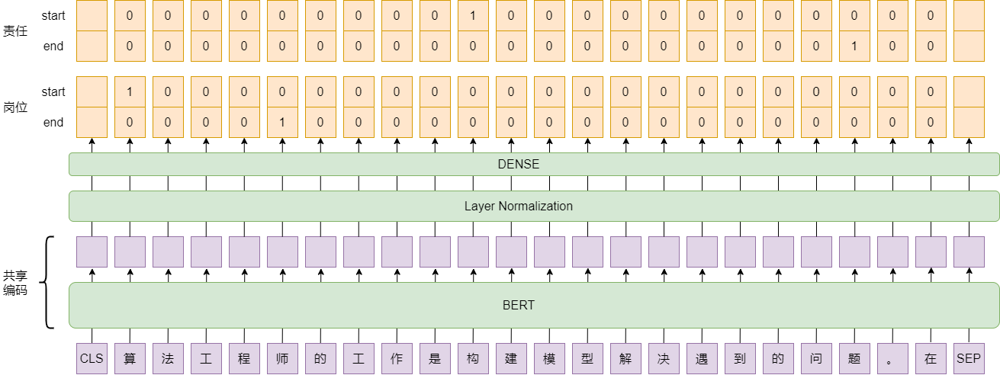
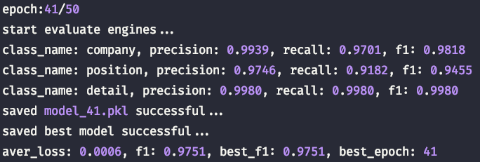

# Entity-extractor-by-binary-tagging

“半指针-半标注”方法实体的抽取器，基于苏神的[三元组抽取](https://kexue.fm/archives/7161)方法改造，这里取消了三元组抽取模型中对s的抽取，直接抽取实体并做分类(相当于直接抽取p和o)。改造后的实体抽取方法不仅可以运用于短实体的抽取，一定程度上可以运用到长句实体的抽取。

## 环境
* python 3.6.7
* transformers==3.0.2
* torch==1.6.0

其他环境见requirements.txt

## 原理



## 运行

* 按照data中的格式整理好数据
```
[
    {
        "text": "XAAAXXXBBXXCCCCCCCCCCCXX",
        "a": "AAA",
        "b": "BB",
        "c": "CCCCCCCCCCC"
    },
]
```

* 在system.config文件中配置好参数，其中class_name必须和json文件中的类别的key一致

```
class_name=[a,b,c]
```

* 选择训练模式

```
################ Status ################
mode=train
# string: train/test/interactive_predict
```

* 根据结果调高或调低decision_threshold这个超参数(sigmoid的输出大于这个参数会被判定为实体的首/尾)

```
decision_threshold=0.5
```

* 运行main.py

## 结果

* example_datasets1



这里的数据模式比较简单，比较容易达到验证集拟合状态

* example_datasets2


当前模型这个人民日报的ner数据集效果不佳，需要近一步调参炼丹

## 测试

* 选择测试模式，程序会读取训练过程中最好的模型

```
################ Status ################
mode=interactive_predict
# string: train/test/interactive_predict
```

交互测试结果如下

* example_datasets1


* example_datasets2


## 参考

* [用bert4keras做三元组抽取](https://kexue.fm/archives/7161)
* [A Novel Cascade Binary Tagging Framework for Relational Triple Extraction](https://arxiv.org/abs/1909.03227)
